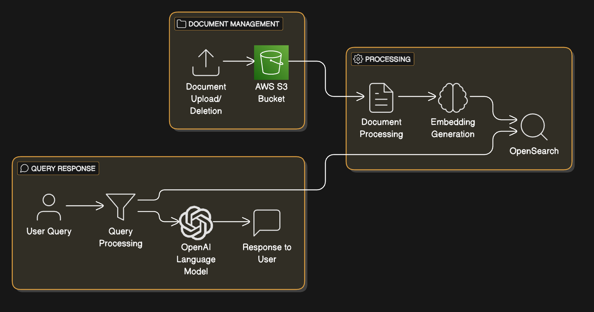

# DocManager - Document Management Gen AI Platform




**DocManager** is an AI-powered document management platform designed for managing documents, extracting embeddings, and performing Retrieval-Augmented Generation (RAG) to provide AI-based responses to user queries. The platform uses FastAPI, OpenSearch, AWS S3, and OpenAI for seamless document processing, storage, and querying.

## Features
- **Document Upload & Deletion**: Allows users to upload and delete documents to/from an S3 bucket.
- **Embeddings Generation**: Automatically generates embeddings for documents using OpenAI's embedding models.
- **OpenSearch Integration**: Stores document embeddings in OpenSearch for efficient querying.
- **RAG (Retrieval-Augmented Generation)**: Performs RAG to retrieve relevant documents and generate AI-based responses using OpenAI's language model.
- **User Query Responses**: Sends user queries to the LLM with relevant context extracted from documents.

## Technologies
- **FastAPI**: A modern Python web framework for building APIs quickly and efficiently.
- **OpenSearch**: A distributed search and analytics engine used to store and search document embeddings.
- **AWS S3**: Amazon Web Services' cloud storage solution for storing documents.
- **OpenAI API**: The GPT-3/4 model is used for generating text responses to user queries based on document embeddings.
- **Uvicorn**: A fast ASGI server for running FastAPI applications.
- **Docker**: Containerization for easy deployment.
- **Pydantic**: Data validation and settings management using Python type annotations.

## Prerequisites
Ensure the following are installed and set up:
- Python 3.8 or higher
- AWS CLI configured with valid credentials
- Docker (optional for containerization)
- FastAPI, Uvicorn, and other dependencies (listed in `requirements.txt`)

### AWS Configuration
- **AWS Profile**: Set up your AWS CLI with a valid profile (`aws configure`).
- **Secrets Manager**: Store necessary secrets (like the OpenAI API key) in AWS Secrets Manager.

### OpenSearch Configuration
- **OpenSearch Index**: Ensure the OpenSearch index (`document_embeddings`) exists in your OpenSearch cluster. If not, the app will create it for you.

## Setup and Installation

### Step 1: Clone the repository
Clone the repository to your local machine:

```bash
git clone <repository-url>
```

### Step 2: Set up environment variables
Create a `.env` file in the root directory with the following content:

```ini
AWS_PROFILE=your_aws_profile
OPENAI_API_KEY=your_openai_api_key
```

Replace `your_aws_profile` and `your_openai_api_key` with your actual AWS profile and OpenAI API key.

### Step 3: Install dependencies
Install the required dependencies using `pip`:

```bash
pip install -r requirements.txt
```

### Step 4: Set up Docker (Optional)
If you want to run the application in a Docker container, follow these steps:

1. Build the Docker image:

    ```bash
    docker build -t docmanager .
    ```

2. Run the Docker container:

    ```bash
    docker run -p 8000:8000 docmanager
    ```

This will build and run the application inside a Docker container, exposing it on port `8000`.

### Step 5: Run the application locally using Uvicorn
If you're not using Docker, you can run the FastAPI app locally using Uvicorn:

```bash
uvicorn app.main:app --reload
```

This will start the FastAPI server on `http://127.0.0.1:8000`.

### Step 6: Access the API
Once the server is running, you can access the following API endpoints:

- **API Docs**: [http://127.0.0.1:8000/docs](http://127.0.0.1:8000/docs)
- **Swagger UI**: [http://127.0.0.1:8000/redoc](http://127.0.0.1:8000/redoc)

### Step 7: Upload Documents
To upload documents to S3 and create embeddings for them, use the `POST /files` endpoint. You can upload multiple files at once, and they will be stored in the S3 bucket specified in the request.

### Step 8: Process Files and Generate Embeddings
To process documents, generate embeddings, and store them in OpenSearch, use the `POST /process-files` endpoint. The application will list the files in the specified S3 folder, generate embeddings, and store them in OpenSearch for later use.

### Step 9: Query Documents
To send a query and retrieve relevant information, use the `POST /query` endpoint. The query will be combined with relevant document embeddings from OpenSearch and sent to OpenAI to generate a response.

---

## API Endpoints

### `POST /upload/files`
**Description**: Upload or delete documents to/from an S3 bucket.

**Request Body**:
```json
{
  "bucket_name": "your-bucket-name",
  "user_id": "user-id",
  "context_id": "context-id",
  "files": [
    {
      "file_name": "document1.txt",
      "file_content": "base64encodedcontent"
    }
  ],
  "action": "upload"  // Use "upload" to upload files or "delete" to remove files
}
```

**Response**:
```json
{
  "message": "Files uploaded successfully",
  "data": {
    "files": ["document1.txt", "document2.pdf"]
  }
}
```

---

### `POST /process-files`
**Description**: Process files from S3 to generate embeddings and store them in OpenSearch.

**Request Body**:
```json
{
  "bucket_name": "your-bucket-name",
  "folder_path": "path/to/your/files"
}
```

**Response**:
```json
{
  "message": "All files processed and stored successfully.",
  "data": []
}
```

---

### `POST /query`
**Description**: Send a user query and get a response based on relevant document content.

**Request Body**:
```json
{
  "query": "What is the summary of document 1?"
}
```

**Response**:
```json
{
  "response": "The document contains a detailed summary about the topic..."
}
```

---

## Docker Deployment (Optional)

If you'd like to run the application in a containerized environment using Docker, follow these steps:

### Step 1: Build the Docker Image
```bash
docker build -t docmanager .
```

### Step 2: Run the Docker Container
```bash
docker run -p 8000:8000 docmanager
```

This will start the FastAPI application in a Docker container, and you can access it at `http://127.0.0.1:8000`.

---

## File Structure

```
Docmanager/
│
├── app/
│   ├── routes/
│   │   ├── upload_delete.py
│   │   ├── process_routes.py
│   │   └── response.py
│   ├── services/
│   │   ├── s3_service.py
│   │   ├── opensearch_service.py
│   │   └── secrets_manager.py
│   ├── utils/
│   │   ├── file_parser.py
│   │   ├── embedding_utils.py
│   │   └── response.py
│   ├── main.py
│   ├── Dockerfile
│   ├── requirements.txt
│   └── .env
│
├── Dockerfile
├── requirements.txt
└── README.md
```

---

## Contributing

If you'd like to contribute to DocManager, feel free to fork the repository and create a pull request with your changes. We welcome improvements and bug fixes!

---

## License

This project is licensed under no one - free to use by anyone.
--- 
